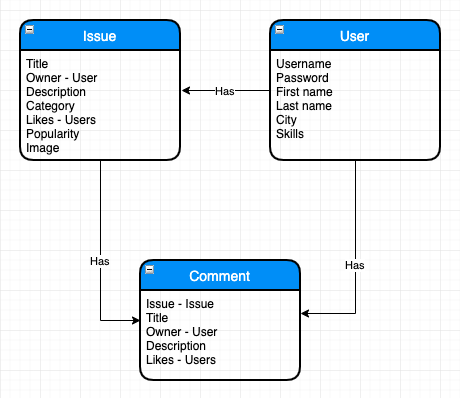

<div align="center">
	<h1 align='center'>Wikiminds</h1>
<!-- 	 -->
</div>
<p align="center">
	Non-profit start-up for and by active, creative and socially involved citizens which can extract socially relevant issues in innovative ways with innovative ideas.
	<br>
<!-- 	<a href="#">Live demo</a> -->
</p>
<br>

## Table of contents

- [Table of contents](#Table-of-contents)
- [Install](#Install)
- [Concept](#Concept)

## Install

You have to need [Node.js](https://nodejs.org/en/download/) installed on your computer to run this project. To install this project on your computer, please follow the steps below from your command line:

```shell
# Clone repository
git clone https://github.com/peppequint/wikiminds.git

# Go to the repository
cd wikiminds

# Install dependencies
npm install

# Server + file changes are detected
npm run dev
```

## Concept

There's a lot of concepting being done all over the world, but the majority of those concepts are willingly or unwillingly being kept behind closed doors. It can be hard for people to share their ideas and/or issues and brainstorm about them with people from all over the world. We are hoping to tackle this issue by creating Wikiminds.

Wikiminds is a platform where issues and innovative minds meet. This leads to the creation of new and out of the box ideas to better the world.

When completed Wikiminds should be a multisided platform free for anyone to use. The goal is to create a application in which users think about issues (e.g. environmental issues) together and come up with creative solutions.

Without users actively contributing there wouldn't be any content on Wikiminds, which is why it is extremely important for users to want to use this platform.

People partaking in Wikiminds projects should be proud of their achievements on the platform and be able to show those achievements on their profile page.

## Core functionalities

- View issues posted by others
- Submit issues
- Submit possible solutions to issues
- Vote on issues
- Vote on solutions
- Bring solutions and issues together
- View the progress of Wikiminds projects 
- Ability for people to contribute their practical skills / knowledge

## Data

Which data is needed to make this project reality?

Right now the following entities are present in the database:

### Issue

- ID
- Title
- Owner (User ID)
- Description
- Category
- Likes (User ID's)
- Popularity (taken from Twitter)
- Image (uploaded to cloudinary)

### User

- ID
- Username
- Password (hashed)
- First name
- Last name
- City
- Skills

### Comment

- ID
- Issue (Issue ID)
- Title
- Owner (User ID)
- Description
- Upvotes (User ID's)
- Downvotes (User ID's)



We are using a mongoDB database, using the mongoose Node.js middleware and uploading the data to mlab. 

Images are being uploaded to and hosted on cloudinary.

## Interactions

Currently the user has the following interaction possibilities within the application:

### Registering an account

Users can register an account by navigating to the register page or going to the `/register` path.

The user has to fill out a form, which when correct, will be sent to the database, where a User entity will be created.

### Logging in

Users can login by pressing the profile button in the top right corner or by navigating to the `/login` path.

The user uses the credentials of their created account to log in, after which the user gains permission to post issues and comments and vote on them.

### Adding an issue

Path: `/issue`

When logged in every user can create issues for everyone to see (including users without an account).

To create an issue the user will have to fill out a form, consisting of mostly text fields and an image uploader.

Here the user can also pick a category which determines the Twitter relevance for the issue.

After posting an issue the user will be redirected to the issue's detail page.


### Adding a comment to an issue

Path: `/details/issueID/#comment`

When viewing the comments on an issue, the user can also leave a comment themselves (provided they are logged in).

This comment requires a title and a description, and when posted will also show which user made the comment.

### Liking an issue

Issues can be liked by pressing the star icon. The total amount of likes is also displayed on the issue page.

### Up- or downvoting a comment

Comments can be up- or downvoted by pressing the `+` or `-` symbol around the total vote count. Comments and issues can only be voted on once.

By up- or downvoting a comment you show your opinion on the validity of a comment.

### Viewing your profile

When logged in you can press the profile icon in the top right corner to view your profile. This will show you your details and the issues you have posted.

### Viewing a profile

When viewing an issue you can also click on the user displayed on the issue page. This will show you the profile of the user that posted the issue, and any other issues they may have posted.

Here you can also see more details about that particular user.